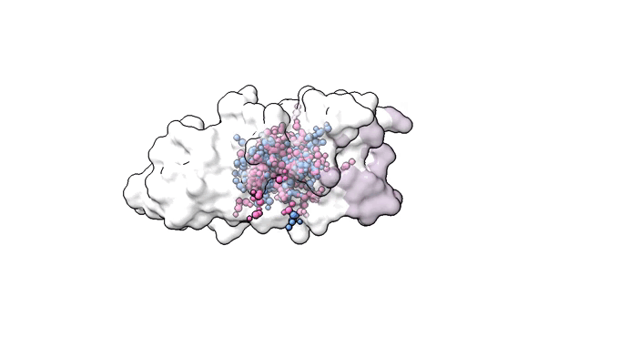

<div align="center">

# A Generative Foundation Model for Antibody Design


[](https://iggm.rubo.wang)
[](https://www.biorxiv.org/content/10.1101/2025.09.12.675771)
[](https://openreview.net/forum?id=zmmfsJpYcq)
[](https://github.com/TencentAI4S/IgGM/blob/master/LICENSE)



</div>


--------------------------------------------------------------------------------

[English](./README.md) | 简体中文

## 🔊 更新消息

* **2025-08-22**: 我们刚刚得知我们使用IgGM参加的抗体设计比赛 ([AIntibody: an experimentally validated in silico antibody discovery design challenge](https://www.nature.com/articles/s41587-024-02469-9)) 得到了前三名的好成绩！ 🎉
* **2025-08-21**: IgGM被扩展到抗体设计的生成基础模型，支持全新抗体设计、亲和力熟化、逆向设计、结构预测、人源化等任务。
* **2025-01-15**: IgGM被收录到ICLR 2025会议，论文标题为"IgGM: A Generative Model for Functional Antibody and Nanobody Design"。


## 📘简介

本仓库包含以下两篇论文的实现：

ICLR 2025论文"IgGM: A Generative Model for Functional Antibody and Nanobody Design"，提出IgGM，该模型可以根据给定的框架区序列设计整体结构，以及 CDR 区序列的工具，同时能够针对特定表位设计相应的抗体。

“A Generative Foundation Model for Antibody Design”，进一步扩展IgGM的能力到抗体设计的生成基础模型，能够实现全新抗体设计、亲和力熟化、逆向设计、结构预测、人源化等任务。


如果您有任何问题，请联系IgGM团队，邮箱为 wangrubo@hotmail.com, wufandi@outlook.com。


## 🧑🏻‍💻开始

###
1. Clone the package
```shell
git clone https://github.com/TencentAI4S/IgGM.git
cd IgGM
```

2. 安装环境

```shell
conda env create -n IgGM -f environment.yaml
conda activate IgGM
pip install pyg_lib torch_scatter torch_sparse torch_cluster torch_spline_conv -f https://data.pyg.org/whl/torch-2.0.1+cu117.html
```
**可选:** 

如果您需要使用relax输出，请安装以下版本的PyRosetta：

```shell
pip install https://west.rosettacommons.org/pyrosetta/release/release/PyRosetta4.Release.python310.ubuntu.wheel/pyrosetta-2025.37+release.df75a9c48e-cp310-cp310-linux_x86_64.whl
```

3. 下载模型(可选，当运行代码时，预训练权重将自动下载)
    * [Zenodo](https://zenodo.org/records/16909543)


**注意**：

如果您将权重下载到文件夹“./checkpoints”中，你可以直接运行后续的代码。

如果您不下载权重，则运行代码时将自动下载权重。

## 📖测试样例

你可以使用fasta文件作为序列的输入，pdb文件作为抗原的输入，示例文件位于examples文件夹中。

* **一个由Luis维护的Colab版本的IgGM可以在[Colab-IgGM](https://github.com/Lefrunila/Colab-IgGM)找到，感谢Luis的贡献！**

* **可选：**
  * 所有命令您可以使用Pyrosetta通过添加"--relax"或"-r" 来relax输出。执行这个命令同时会添加侧链原子。
  * 所有命令您可以通过添加"--max_antigen_size 384"或''-mas 384''来指定抗原的最大截断长度为384，以避免内存避免内存。

为了方便后续处理，你需要准备一个fasta文件和一个pdb文件，你的fasta文件应该具有以下的结构，具体可以参考examples文件夹。

```
>H  # 重链ID
VQLVESGGGLVQPGGSLRLSCAASXXXXXXXYMNWVRQAPGKGLEWVSVVXXXXXTFYTDSVKGRFTISRDNSKNTLYLQMNSLRAEDTAVYYCARXXXXXXXXXXXXXXWGQGTMVTVSS
>L # 轻链ID
DIQMTQSPSSLSASVGDRVSITCXXXXXXXXXXXWYQQKPGKAPKLLISXXXXXXXGVPSRFSGSGSGTDFTLTITSLQPEDFATYYCXXXXXXXXXXXFGGGTKVEIK
>A # 抗原ID, 需要跟pdb文件保持一致
NLCPFDEVFNATRFASVYAWNRKRISNCVADYSVLYNFAPFFAFKCYGVSPTKLNDLCFTNVYADSFVIRGNEVSQIAPGQTGNIADYNYKLPDDFTGCVIAWNSNKLDSKVGGNYNYRYRLFRKSNLKPFERDISTEIYQAGNKPCNGVAGVNCYFPLQSYGFRPTYGVGHQPYRVVVLSFELLHAPATVCGP
```
* 'X'表示需要设计的区域
* 如果需要获得抗原的表位，可以使用以下命令

```
python design.py --fasta examples/fasta.files.native/8iv5_A_B_G.fasta --antigen examples/pdb.files.native/8iv5_A_B_G.pdb --cal_epitope

antigen表示已知复合物的结构，fasta表示已知复合物的序列，会返回后续需要的epitope格式，复制之后即可将fasta替换成你需要设计的序列进行设计。

生成的epitope格式（序号从1开始）为：7 8 9 10 11 12 13 14 108 109 110 111 112 113 114 115 116 118 167

如果根据序列来指定epitope的话，确保序列的顺序与pdb文件中的顺序一致，将对应位置的序号标出来。
```

#### 示例一：使用IgGM预测抗体结构和纳米抗体结构
* 如果PDB中有复合物的结构，该命令将自动生成表位信息，这种情况下可以删除（--epitope）。
```
# antibody
python design.py --fasta examples/fasta.files.native/8iv5_A_B_G.fasta --antigen examples/pdb.files.native/8iv5_A_B_G.pdb --epitope 7 8 9 10 11 12 13 14 108 109 110 111 112 113 114 115 116 118 167 157 158 160 161 162 163 164

# nanobody
python design.py --fasta examples/fasta.files.native/8q94_C_NA_A.fasta --antigen examples/pdb.files.native/8q94_C_NA_A.pdb --epitope 109 110 111 112 113 114 115 116 117 120 121 140 141 148 149 150 151 152 153 154 155 156 157 158 159 160 161 162 163 165 166 167
```

#### 示例二：给定复合物的结构，使用IgGM设计出对应的序列
* 如果PDB中有复合物的结构，该命令将自动生成表位信息，这种情况下可以删除（--epitope）。
```
# antibody
python design.py --fasta examples/fasta.files.design/8hpu_M_N_A/8hpu_M_N_A_CDR_H3.fasta --antigen examples/pdb.files.native/8hpu_M_N_A.pdb --epitope 7 8 9 10 11 12 13 14 108 109 110 111 112 113 114 115 116 118 167 157 158 160 161 162 163 164 --run_task inverse_design

# nanobody
python design.py --fasta examples/fasta.files.design/8q95_B_NA_A/8q95_B_NA_A_CDR_H3.fasta --antigen examples/pdb.files.native/8q95_B_NA_A.pdb --epitope 109 110 111 112 113 114 115 116 117 120 121 140 141 148 149 150 151 152 153 154 155 156 157 158 159 160 161 162 163 165 166 167 --run_task inverse_design
```

#### 示例三：使用IgGM进行框架区域序列的重新设计
* 这里以人源化为例, 需要用到[BioPhi](https://biophi.dichlab.org/humanization/humanize/)。
```
# 初始小鼠抗体
>H
QVQLQESGPGLVAPSQSLSITCTVSGFSLTGYGVNWVRQPPGKGLEWLGMIWGDGNTDYNSALKSRLSISKDNSKSQVFLKMNSLHTDDTARYYCARERDYRLDYWGQGTTLTVSS
>L
DIVLTQSPASLSASVGETVTITCRASGNIHNYLAWYQQKQGKSPQLLVYYTTTLADGVPSRFSGSGSGTQYSLKINSLQPEDFGSYYCQHFWSTPRTFGGGTKLEIK
>A
KVFGRCELAAAMKRHGLDNYRGYSLGNWVCAAKFESNFNTQATNRNTDGSTDYGILQINSRWWCNDGRTPGSRNLCNIPCSALLSSDITASVNCAKKIVSDGNGMNAWVAWRNRCKGTDVQAWIRGCRL

# 只针对人源化，使用BioPhi对小鼠抗体进行初始人源化
>H
QVQLQESGPGLVKPSETLSLTCTVSGFSLTGYGWGWIRQPPGKGLEWIGSIWGDGNTYYNPSLKSRVTISVDTSKNQFSLKLSSVTAADTAVYYCARERDYRLDYWGQGTLVTVSS
>L
DIQLTQSPSFLSASVGDRVTITCRASGNIHNYLAWYQQKPGKAPKLLIYYTTTLQSGVPSRFSGSGSGTEFTLTISSLQPEDFATYYCQHFWSTPRTFGGGTKVEIK
>A
KVFGRCELAAAMKRHGLDNYRGYSLGNWVCAAKFESNFNTQATNRNTDGSTDYGILQINSRWWCNDGRTPGSRNLCNIPCSALLSSDITASVNCAKKIVSDGNGMNAWVAWRNRCKGTDVQAWIRGCRL

# 比较不同FR区域的人源化序列与小鼠抗体的差异，获得需要优化的部分，这里以FR1为例
>H
QVQLQESGPGLVXPSXXLSXTCTVSGFSLTGYGWGWIRQPPGKGLEWIGSIWGDGNTYYNPSLKSRVTISVDTSKNQFSLKLSSVTAADTAVYYCARERDYRLDYWGQGTLVTVSS
>L
DIQLTQSPSFLSASVGDRVTITCRASGNIHNYLAWYQQKPGKAPKLLIYYTTTLQSGVPSRFSGSGSGTEFTLTISSLQPEDFATYYCQHFWSTPRTFGGGTKVEIK
>A
KVFGRCELAAAMKRHGLDNYRGYSLGNWVCAAKFESNFNTQATNRNTDGSTDYGILQINSRWWCNDGRTPGSRNLCNIPCSALLSSDITASVNCAKKIVSDGNGMNAWVAWRNRCKGTDVQAWIRGCRL

# 使用IgGM设计FR1区域

python design.py --fasta examples/humanization/fasta.files.design.heavy_fr1/1vfb_B_A_C.fasta --antigen examples/humanization/pdb.files.native/1vfb_B_A_C.pdb --run_task fr_design

```

#### 示例四：使用IgGM对针对给定抗原的抗体和纳米抗体进行亲和力熟化。
```
# antibody
python design.py --fasta examples/fasta.files.design/8hpu_M_N_A/8hpu_M_N_A_CDR_H3.fasta --antigen examples/pdb.files.native/8hpu_M_N_A.pdb --fasta_origin examples/fasta.files.native/8hpu_M_N_A.fasta --run_task affinity_maturation --num_samples 100

# nanobody
python design.py --fasta examples/fasta.files.design/8q95_B_NA_A/8q95_B_NA_A_CDR_3.fasta --antigen examples/pdb.files.native/8q95_B_NA_A.pdb --fasta_origin examples/fasta.files.native/8q95_B_NA_A.fasta --run_task affinity_maturation --num_samples 100

# 如果你有多张卡，你可以执行以下命令来并行执行
bash scripts/multi_runs.sh

# 对于生成的序列，你可以参考以下文件来收集并保存结果同时可视化结果
scripts/Merge_output.ipynb

# 执行上述命令将生成一个名为对应设计ID的文件夹，其中包含以下内容：
- outputs/maturation/results/8hpu_M_N_A
- outputs/maturation/results/8hpu_M_N_A/dup # 重复序列的氨基酸分布图
- outputs/maturation/results/8hpu_M_N_A/dup/logo.png
- outputs/maturation/results/8hpu_M_N_A/dup/stacked_bar_chart.png
- outputs/maturation/results/8hpu_M_N_A/original # 原始序列的氨基酸分布图
- outputs/maturation/results/8hpu_M_N_A/original/logo.png
- outputs/maturation/results/8hpu_M_N_A/original/stacked_bar_chart.png
- outputs/maturation/results/8hpu_M_N_A/dedup.csv # 去重序列的统计结果
- outputs/maturation/results/8hpu_M_N_A/dedup_diff_freq.csv # 去重序列的统计结果（包含生成频率）
- outputs/maturation/results/8hpu_M_N_A/dup.csv # 重复序列的统计结果

# 基于outputs/maturation/results/8hpu_M_N_A/dedup_diff_freq.csv按照频率进行筛选

```

#### 示例五：使用IgGM设计针对给定抗原的抗体和纳米抗体CDR H3环的序列，并预测整体结构。
```
# antibody
python design.py --fasta examples/fasta.files.design/8hpu_M_N_A/8hpu_M_N_A_CDR_H3.fasta --antigen examples/pdb.files.native/8hpu_M_N_A.pdb

# nanobody
python design.py --fasta examples/fasta.files.design/8q95_B_NA_A/C8q95_B_NA_A_DR_3.fasta --antigen examples/pdb.files.native/8q95_B_NA_A.pdb

```

#### 示例六: 使用 IgGM 设计针对给定抗原的抗体和纳米抗体 CDR 环序列，并预测整体结构。
```
# antibody
python design.py --fasta examples/fasta.files.design/8hpu_M_N_A/8hpu_M_N_A_CDR_All.fasta --antigen examples/pdb.files.native/8hpu_M_N_A.pdb

# nanobody
python design.py --fasta examples/fasta.files.design/8q95_B_NA_A/8q95_B_NA_A_CDR_All.fasta --antigen examples/pdb.files.native/8q95_B_NA_A.pdb
```

可以指定其他区域进行设计；可以在示例文件夹中探索更多示例。

#### 示例七: 无需提供复合物的结构信息，仅仅基于给定抗原和结合表位设计抗体和纳米体CDR环序列，预测整体结构。
* **可以针对一个全新的表位进行抗体的设计**
```
# antibody
python design.py --fasta examples/fasta.files.design/8hpu_M_N_A/8hpu_M_N_A_CDR_All.fasta --antigen examples/pdb.files.native/8hpu_M_N_A.pdb --epitope 7 8 9 10 11 12 13 14 108 109 110 111 112 113 114 115 116 118 167 157 158 160 161 162 163 164

# nanobody
python design.py --fasta examples/fasta.files.design/8q95_B_NA_A/8q95_B_NA_A_CDR_All.fasta --antigen examples/pdb.files.native/8q95_B_NA_A.pdb --epitope 109 110 111 112 113 114 115 116 117 120 121 140 141 148 149 150 151 152 153 154 155 156 157 158 159 160 161 162 163 165 166 167
```
对于全新的抗原，您可以指定表位来设计可以与这些表位结合的抗体。

#### 示例八: 合并多条抗原链到一条链，需要指定合并的链的id。

```
python scripts/merge_chains.py --antigen examples/pdb.files.native/8ucd.pdb --output ./outputs --merge_ids A_B_C
```

# 🤝🏻License

我们的模型和代码在 MIT 许可下发布，可以自由用于学术和商业目的。

如果您有任何问题，请联系IgGM团队，邮箱为 wangrubo@hotmail.com, wufandi@outlook.com。

## 📋️Citing IgGM

如果你在研究中使用了IgGM, 请引用我们的工作


```BibTeX
@inproceedings{
wang2025iggm,
title={Ig{GM}: A Generative Model for Functional Antibody and Nanobody Design},
author={Wang, Rubo and Wu, Fandi and Gao, Xingyu and Wu, Jiaxiang and Zhao, Peilin and Yao, Jianhua},
booktitle={The Thirteenth International Conference on Learning Representations},
year={2025},
url={https://openreview.net/forum?id=zmmfsJpYcq}
}
```
```BibTeX
@article {Wang2025.09.12.675771,
	author = {Wang, Rubo and Wu, Fandi and Shi, Jiale and Song, Yidong and Kong, Yu and Ma, Jian and He, Bing and Yan, Qihong and Ying, Tianlei and Zhao, Peilin and Gao, Xingyu and Yao, Jianhua},
	title = {A Generative Foundation Model for Antibody Design},
	year = {2025},
	doi = {10.1101/2025.09.12.675771},
	publisher = {Cold Spring Harbor Laboratory},
	URL = {https://www.biorxiv.org/content/early/2025/09/16/2025.09.12.675771},
	journal = {bioRxiv}
}
```
