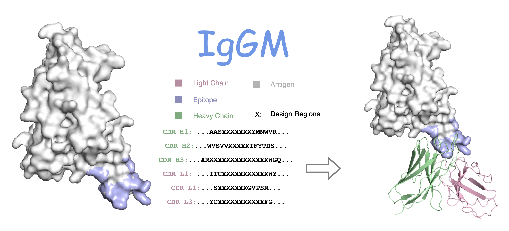
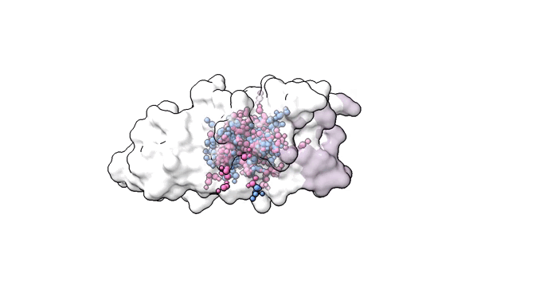
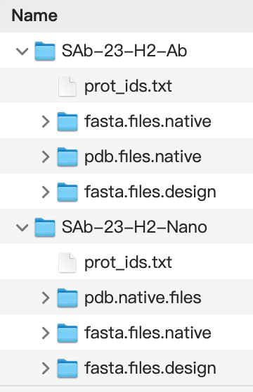

--------------------------------------------------------------------------------

English | [简体中文](./README-zh.md)

This package provides an implementation of IgGM inference, which can design.py the overall structure based on a given framework region sequence, as well as tools for CDR region sequences, and can design.py corresponding antibodies against specific epitopes.

We also provide:

The test set (SAb-23H2) constructed in the paper includes the latest antigen-antibody complexes published since the second half of 2023, with rigorous deduplication applied.


Any publication that discloses findings arising from using this source code or the model parameters
should cite the IgGM paper.

Please also refer to the Supplementary Information for a detailed description of the method.

If you have any questions, please contact the IgGM team at fandiwu@tencent.com.

For business partnership opportunities, please contact leslielwang@tencent.com.


## OverView



### Main Results(SAb-23H2-Ab)

|      **Model**      | **AAR-CDR-H3** | **RMSD-CDR-H3** | **DockQ** |
|:-------------------:|:--------------:|:---------------:|:---------:|
|   DiffAb(IgFold)    |     0.214      |      2.358      |   0.022   |
| DiffAb(AlphaFold 3) |     0.226      |      2.300      |   0.208   |
|    MEAN(IgFold)     |     0.248      |      2.741      |   0.022   |
|  MEAN(AlphaFold 3)  |     0.246      |      2.646      |   0.207   |
|       dyMEAN        |     0.294      |      2.454      |   0.079   |
|     **IgGM**      |     0.360      |      2.131      |   0.246   |


## Installation

###
1. Clone the package
```shell
git clone https://github.com/TencentAI4S/IgGM.git
cd IgGM
```

2. Prepare the environment

```shell
conda env create -n IgGM -f environment.yaml
conda activate IgGM
pip install pyg_lib torch_scatter torch_sparse torch_cluster torch_spline_conv -f https://data.pyg.org/whl/torch-2.0.1+cu117.html
```

3. Download pre-trained weights under params directory
    * [Zenodo](https://zenodo.org/records/13790269)

**Note**:
If you download the weights in the folder `./checkpoints`, you can proceed directly with the following steps.

## Dataset
###
Test set we construct in our paper

  * [Zenodo](https://zenodo.org/records/13790269/files/IgGM_Test_set.tar.gz?download=1) (download from zenodo)



This folder contains files related to the dataset.
- SAb-23-H2-Ab
  - **prot_ids.txt**: Text file containing protein IDs.
  - **fasta.files.native**: Original fasta file (H represents heavy chain, L represents light chain, A represents antigen, corresponding to the last three letters in the ID).
  - **pdb.files.native**: Original pdb structure file (H represents heavy chain, L represents light chain, A represents antigen, corresponding to the last three letters in the ID).
  - **fasta.files.design**: Contains the masked CDR area fasta file, where X represents mask.

- SAb-23-H2-Nano
  - **prot_ids.txt**: Text file containing protein IDs.
  - **fasta.files.native**: Original fasta file (H represents antibody, NA represents absence, and A represents antigen, which correspond to the last three letters in the ID.).
  - **pdb.files.native**: Original pdb structure file (H represents antibody, NA represents absence, and A represents antigen, which correspond to the last three letters in the ID.).
  - **fasta.files.design**: Contains the masked CDR area fasta file, where X represents mask.
## Quick Start

You can use a fasta file (--fasta) and antigen's pdb file(--pdb).


#### Example 1: predicting the structure of an antibody & nanobody using IgGM
```
# antibody
python design.py --fasta examples/fasta.files.native/8iv5_A_B_G.fasta --antigen examples/pdb.files.native/8iv5_A_B_G.pdb

# nanobody
python design.py --fasta examples/fasta.files.native/8q94_C_NA_A.fasta --antigen examples/pdb.files.native/8q94_C_NA_A.pdb
```

#### Example 2: design.py the sequence of an antibody & nanobody CDR H3 loops against a given antigen using IgGM, and predict the overall structure.
```
# antibody
python design.py --fasta examples/fasta.files.design/8hpu_M_N_A/8hpu_M_N_A_CDR_H3.fasta --antigen examples/pdb.files.native/8hpu_M_N_A.pdb

# nanobody
python design.py --fasta examples/fasta.files.design/8q95_B_NA_A/8q95_B_NA_A_CDR_3.fasta --antigen examples/pdb.files.native/8q95_B_NA_A.pdb
```

#### Example 3:  design.py the sequence of an antibody & nanobody CDR loops against a given antigen using IgGM, and predict the overall structure.
```
# antibody
python design.py --fasta examples/fasta.files.design/8hpu_M_N_A/8hpu_M_N_A_CDR_All.fasta --antigen examples/pdb.files.native/8hpu_M_N_A.pdb

# nanobody
python design.py --fasta examples/fasta.files.design/8q95_B_NA_A/8q95_B_NA_A_CDR_All.fasta --antigen examples/pdb.files.native/8q95_B_NA_A.pdb
```

You can specify other regions for design; more examples can be explored in the examples folder.

#### Example 4: IgGM design.py is used to sequence the CDR regions of antibodies and nano-antibodies under the conditions of given antigens and binding epitopes, and predict the overall structure. Antibodies will be designed with epitope information.
```
# antibody
python design.py --fasta examples/fasta.files.design/8hpu_M_N_A/8hpu_M_N_A_CDR_All.fasta --antigen examples/pdb.files.native/8hpu_M_N_A.pdb --epitope 126 127 129 145 146 147 148 149 150 155 156 157 158 160 161 162 163 164

# nanobody
python design.py --fasta examples/fasta.files.design/8q95_B_NA_A/8q95_B_NA_A_CDR_All.fasta --antigen examples/pdb.files.native/8q95_B_NA_A.pdb --epitope 41 42 43 44 45 46 49 50 70 71 73 74
```
For a completely new antigen, you can specify epitopes to design.py antibodies that can bind to those epitopes.


## Citing IgGM

If you use IgGM in your research, please cite our paper

```BibTeX
@article{
}
```


